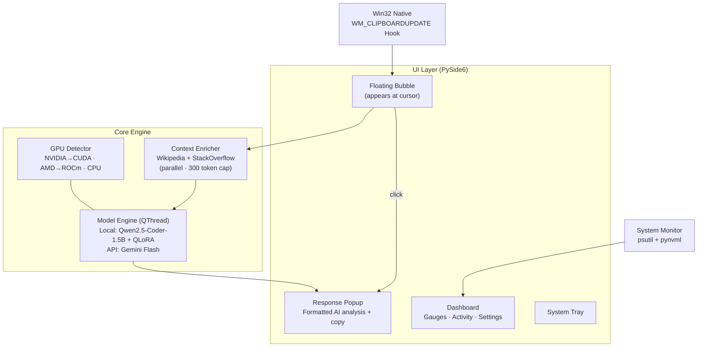

<p align="center">
  
</p>
<h1 align="center">CodeMate: Your Coding Companion</h1>
<p align="center">
  <strong>AI-powered desktop code debugger and explainer that lives in your clipboard</strong><br/>
  <em>Copy code anywhere → floating bubble appears → one click → instant AI analysis</em>
</p>

<p align="center">
  
  
  
  
  
  
</p>

---

## Table of Contents

- [Overview](#overview)
- [Why CodeMate](#why-codemate)
- [Features](#features)
- [System Architecture](#system-architecture)
- [General Processing Overview](#general-processing-overview)
- [Core Mechanics](#core-mechanics)
- [User Interface Guide](#user-interface-guide)
- [GPU Detection and Performance](#gpu-detection-and-performance)
- [How to Run](#how-to-run)
- [Build Standalone EXE](#build-standalone-exe)
- [Project Structure](#project-structure)
- [Dependencies](#dependencies)
- [Configuration](#configuration)
- [Future Improvement Ideas](#future-improvement-ideas)
- [Author](#author)

---

## Overview

**CodeMate** is a desktop AI assistant that monitors your clipboard for code snippets. The moment you copy code — from VS Code, a browser, a terminal, or Stack Overflow — a floating bubble appears near your cursor. Click it, and CodeMate analyzes the code using a fine-tuned **Qwen2.5-Coder-1.5B-Instruct** model (augmented by custom QLoRA adapters) to:

- **🐛 Debug** — detect errors, tracebacks, and logical bugs, then suggest corrected code
- **📖 Explain** — generate step-by-step walkthroughs of clean, functional code

Before inference, CodeMate automatically enriches the prompt with **web-sourced context** — querying Wikipedia and StackOverflow for relevant information about the libraries and functions in your code.

> All processing runs **locally on your machine** (GPU or CPU). An optional API backend (Gemini Flash) is available for machines without GPU resources.

### Why CodeMate?

Every AI code tool requires you to go to *it* — open a browser, paste code, wait. CodeMate comes to *you*.

| Metric / Feature | Traditional AI Code Tools | CodeMate |
| :--- | :--- | :--- |
| **Workflow** | Open ChatGPT/Copilot Chat → paste code → wait → copy result back | Copy code anywhere → bubble appears → click → response popup with copy button |
| **Context** | You provide context manually | **Auto-enriched** — CodeMate crawls Wikipedia + StackOverflow for relevant context before inference |
| **Model** | Cloud-only (GPT-4, Claude) | **Local-first** — fine-tuned Qwen2.5-Coder-1.5B runs on your GPU/CPU. No internet needed for inference |
| **Integration** | Browser tab or IDE extension | **System-wide** — works with any app that puts text on the clipboard |
| **Privacy** | Code sent to cloud APIs | Code stays on your machine (API mode is opt-in) |
| **Latency** | Network round-trip | Direct GPU inference — sub-second on modern hardware |
| **Fine-tuning** | Generic model | Custom QLoRA adapters trained on 13K+ debug/explain examples |

---

## Features

### Intelligent Clipboard Monitoring
- **Win32 Native Listener**: Uses `WM_CLIPBOARDUPDATE` for zero-latency clipboard detection — no polling overhead.
- **Code Heuristic Engine**: A 14-pattern regex engine identifies code vs. plain text (supports Python, JS, C++, Java, and tracebacks).
- **Polling Fallback**: Gracefully falls back to `pyperclip`-based polling if Win32 hooks fail.

### Dual Inference Backend
- **Local Model**: Qwen2.5-Coder-1.5B-Instruct + custom QLoRA adapter (rank=16, $\alpha$=32).
- **GPU Auto-Detection**: Automatically configures NVIDIA (CUDA + 4-bit NF4 quantization) or AMD (ROCm float16), with a CPU float32 fallback.
- **API Fallback**: Optional Gemini Flash backend for machines without GPU — transparent to the user.
- **Force CPU Mode**: One-click toggle to force CPU inference (useful when GPU is busy).

### Web Context Enrichment
- **Keyword Extraction**: Extracts meaningful identifiers from code, filtering language keywords.
- **Batch Querying**: Groups keywords into batches, querying Wikipedia and StackOverflow in parallel.
- **Token Budget**: Caps context at 300 tokens to keep prompts focused.
- **Pipeline Logging**: Full pipeline (input → keywords → queries → context → prompt → response) logged to `log.txt`.

### Desktop UI
- **Floating Bubble**: Animated, always-on-top circle with radial gradient — appears at cursor position, auto-hides after 6s.
- **Response Popup**: Dark-themed popup with formatted AI response + one-click copy button.
- **Dashboard**: Full-featured control panel: system metrics gauges (CPU/VRAM/GPU/RAM), model status, activity log, settings.
- **System Tray**: Minimize to tray on close, double-click to restore, right-click menu for quit.

---

## System Architecture



<details>
<summary>ASCII fallback (click to expand)</summary>

```
┌─────────────────────────────────────────────────────────────────┐
│                    CodeMate Desktop App                         │
│                                                                 │
│  ┌───────────────┐    ┌──────────────────────────────────────┐  │
│  │  Clipboard    │    │          UI Layer (PySide6)          │  │
│  │  Monitor      │    │                                      │  │
│  │               │    │  ┌────────────┐  ┌────────────────┐  │  │
│  │ Win32 native  ├───►│  │  Floating  │  │   Dashboard    │  │  │
│  │ WM_CLIPBOARD  │    │  │  Bubble    │  │   (gauges,     │  │  │
│  │ UPDATE hook   │    │  └─────┬──────┘  │    activity,   │  │  │
│  └───────────────┘    │        │click    │    settings)   │  │  │
│                       │  ┌─────▼──────┐  └────────────────┘  │  │
│                       │  │  Response  │  ┌───────────────┐   │  │
│                       │  │  Popup     │  │  System Tray  │   │  │
│                       │  └────────────┘  └───────────────┘   │  │
│                       └──────────────────────────────────────┘  │
│                                                                 │
│  ┌──────────────────────────────────────────────────────────┐   │
│  │                    Core Engine                           │   │
│  │                                                          │   │
│  │  ┌──────────────┐  ┌──────────────┐  ┌───────────────┐   │   │
│  │  │ Context      │  │ Model Engine │  │ GPU Detector  │   │   │
│  │  │ Enricher     │  │              │  │               │   │   │
│  │  │              │  │ Local:       │  │ NVIDIA→CUDA   │   │   │
│  │  │ Wikipedia    │  │  Qwen2.5     │  │ AMD→ROCm      │   │   │
│  │  │ StackOverflow│  │  + QLoRA     │  │ CPU fallback  │   │   │
│  │  │ (parallel)   │  │              │  └───────────────┘   │   │
│  │  └──────┬───────┘  │ API:         │                      │   │
│  │         │          │  Gemini Flash│                      │   │
│  │         │context   │              │                      │   │
│  │         └─────────►│  QThread     │                      │   │
│  │                    │  inference   │                      │   │
│  │                    └──────────────┘                      │   │
│  └──────────────────────────────────────────────────────────┘   │
│                                                                 │
│  ┌──────────────────────────────────────────────────────────┐   │
│  │  System Monitor (psutil + pynvml) → Dashboard gauges     │   │
│  └──────────────────────────────────────────────────────────┘   │
└─────────────────────────────────────────────────────────────────┘
```

</details>

---

## General Processing Overview

The application processes code in four stages:

1. **Clipboard Hook & Detection**: Windows native `WM_CLIPBOARDUPDATE` hook intercepts clipboard changes. The text is matched against 14 regex patterns in [looks_like_code](codemate_app/core/clipboard_monitor.py#L26). If the criteria are met, the floating bubble appears at the cursor.
2. **Context Enrichment**: When the user clicks the bubble, it enters its spinning state. A background thread parses identifiers, queries Wikipedia and StackOverflow in parallel using a ThreadPool, and produces a focused context block (capped at 300 tokens).
3. **Inference & Routing**: The combined code and context are structured into a prompt using the chat template. The model engine routes the request to either the local quantized Qwen2.5-Coder model (using CUDA/ROCm/CPU) or the Google Gemini API.
4. **Display & Log**: The response is rendered in a dark-themed frameless popup with a one-click copy button, and the complete execution trace is appended to `log.txt`.

---

## Core Mechanics

### Heuristics and Code Detection
CodeMate monitors the clipboard and filters text through [looks_like_code](codemate_app/core/clipboard_monitor.py#L26) to prevent regular text from triggering the UI. It runs checks using 14 pre-compiled regex patterns representing:
- **Function/Class structures**: `def \w+\(`, `class \w+`, `const|let|var|function`, `public|private|static|void`
- **Control statements**: `if|elif|else|for|while` followed by a colon
- **Structural syntax**: Curly braces, semicolons, brackets, or indentation blocks (`^\s{2,}\S`)
- **Execution markers**: Error tracebacks, libraries like `std::`, `#include`, or `print(` statement calls.

If at least **two** distinct patterns match and the text length is **20+ characters**, the text is classified as code.

### How Context Enrichment Works
To give the local model auxiliary documentation on APIs and packages, a background thread runs the following pipeline:
1. **Keyword Extraction**: Identifiers are parsed using regex, skipping language keywords (e.g., `def`, `return`, `async`) listed in `STOP_WORDS`.
2. **Batch Sizing**: Based on code token length, keywords are segmented to ensure query breadth:
   - `< 50 tokens`: 1 batch (first 4 words)
   - `50 - 200 tokens`: 3 batches (start, middle, end)
   - `> 200 tokens`: 5 batches (evenly distributed)
3. **Query Strategy**: Queries are fired in parallel using a `ThreadPoolExecutor`:
   - **Wikipedia**: Requests up to 3 batches (first 2 sentences retrieved per page).
   - **StackOverflow (via howdoi)**: Queries the first batch to get the top code answer.
4. **Context Capping**: Assembled results are combined and truncated to `300 tokens` to avoid prompt bloat.

### Pipeline Logging
Every transaction is saved to `log.txt` in the root folder, showing the complete flow:
```
========================================================================
  CODEMATE PIPELINE LOG — 2026-04-30 03:45:12
========================================================================

── INPUT RECEIVED ──────────────────────────────────────
def factorial(n):
    if n == 0:
        return 1
    return n * factorial(n)

RecursionError: maximum recursion depth exceeded

── WEB CRAWLER — KEYWORD BATCHES ───────────────────────
  Batch 1: factorial RecursionError maximum recursion

── WEB CRAWLER — QUERIES & RESPONSES ──────────────────
  [Wikipedia] Query: "factorial RecursionError maximum recursion"
           Result: [Wiki:Recursion] Recursion occurs when...

  [StackOverflow] Query: "factorial RecursionError maximum recursion"
           Result: [SO] The recursive call should decrement n...

── ASSEMBLED CONTEXT ───────────────────────────────────
[Wiki:Recursion] Recursion occurs when... | [SO] The recursive call...

── FINAL PROMPT ────────────────────────────────────────
<|im_start|>system
You are CodeMate, an AI code assistant...<|im_end|>
...
── INFERENCE RESPONSE ──────────────────────────────────
**Bug Found: Infinite Recursion**
The recursive call factorial(n) never decrements n...
========================================================================
```

---

## User Interface Guide

The UI is built using PySide6 with custom dark themes:

- **Dashboard**: Displays gauges (GPU, VRAM, CPU, RAM) that animate smoothly, system hardware cards, settings checkboxes, and an activity log displaying the last 50 events.
- **Floating Bubble**: Frameless widget centered at the cursor. Switches between idle pulsing (glow matches the model readiness) and a smooth spinning loading animation.
- **Response Popup**: Draggable and frameless. Contains a text area displaying markdown text and a Copy button that flashes "Copied!" green for feedback.
- **Settings Dialog**: Accessible via the dashboard settings gear. Houses toggle switches for API Mode and a password-masked line edit for the Gemini API key.
- **Tray Icon**: Adds a tray menu containing "Open Dashboard" and "Quit CodeMate" options.

---

## GPU Detection and Performance

CodeMate detects system capability on startup to choose the optimal backend:

| GPU Type | Compute Backend | Quantization | Performance |
| :--- | :--- | :--- | :--- |
| **NVIDIA** (CUDA) | CUDA | 4-bit NF4 (bitsandbytes) | **Fast** (~2-5s latency) |
| **AMD** (ROCm) | ROCm | float16 | **Medium** (~5-10s latency) |
| **Unsupported / CPU** | CPU | float32 | **Slow** (~15-30s latency) |

---

## How to Run

### Option A — From Source (Development)
**Prerequisites**: Python 3.10+, Windows 10/11, GPU (Optional)
```bash
cd codemate_app
pip install -r requirements.txt
python main.py
```
*Note: On the first launch, the ~3GB base model (Qwen2.5-Coder-1.5B-Instruct) is downloaded from HuggingFace.*

### Option B — Standalone EXE
Download `CodeMate.exe` from Releases.
Double-click `CodeMate.exe` to run. The EXE caches the model locally at `%LOCALAPPDATA%/CodeMate/CodeMate/model_cache/`.

---

## Build Standalone EXE

The packaging configuration is managed via [build.py](codemate_app/build.py).
```bash
cd codemate_app
pip install -r requirements.txt
python build.py
```
This builds `dist/CodeMate.exe`.
- **Bundled**: Python runtime, PySide6, torch, transformers, and app assets.
- **Not Bundled**: The ~3GB base model (downloaded on first run to keep the binary size manageable).

---

## Project Structure

```
genai/
├── codemate_app/                    # Desktop application
│   ├── main.py                      # App controller
│   ├── config.py                    # Global configuration
│   ├── requirements.txt             # App dependencies
│   ├── build.py                     # PyInstaller build script
│   ├── build.spec                   # PyInstaller spec file
│   │
│   ├── core/                        # Core logic
│   │   ├── model_engine.py          # Dual-backend inference
│   │   ├── clipboard_monitor.py     # Win32 clipboard monitor
│   │   ├── context_enricher.py      # Wikipedia + StackOverflow searcher
│   │   ├── gpu_detector.py          # Auto GPU detector
│   │   ├── system_monitor.py        # System stats collector
│   │   └── startup_manager.py       # Registry auto-start manager
│   │
│   └── ui/                          # UI views
│       ├── dashboard.py             # Dashboard panel
│       ├── floating_bubble.py       # Bubble action widget
│       ├── response_popup.py        # AI Response window
│       ├── settings_dialog.py       # Advanced settings
│       ├── tray_icon.py             # System tray control
│       ├── theme.py                 # QSS styling tokens
│       └── widgets/                 # Custom Qt widgets (Gauges, cards)
│
├── Model Training CODE/             # Model training scripts
│   ├── data/                        # Dataset generation (synthetic, explanations)
│   ├── training/                    # Fine-tuning scripts
│   └── evaluation/                  # Baseline comparators & metric evaluators
└── README.md                        # Merged technical documentation
```

### Key Components

| Component | File Path | Role |
| :--- | :--- | :--- |
| **App Controller** | [main.py](codemate_app/main.py) | Controller. Manages setting updates, window restarts, and routes signals between components. |
| **Model Engine** | [model_engine.py](codemate_app/core/model_engine.py) | Manages local model loading (in QThread), inference execution, and Gemini client fallbacks. |
| **Clipboard Monitor** | [clipboard_monitor.py](codemate_app/core/clipboard_monitor.py) | Win32 native clipboard hook listener with standard polling fallback thread. |
| **Context Enricher** | [context_enricher.py](codemate_app/core/context_enricher.py) | Parses identifiers, executes parallel web queries, and caps token size. |
| **GPU Detector** | [gpu_detector.py](codemate_app/core/gpu_detector.py) | Detects NVIDIA (NVML), AMD (ROCm), or CPU fallback configurations. |
| **System Monitor** | [system_monitor.py](codemate_app/core/system_monitor.py) | Background psutil/pynvml thread for gathering CPU, RAM, and GPU statistics. |

---

## Dependencies

| Package | Purpose |
| :--- | :--- |
| `torch` | Tensor computations and local model inference |
| `transformers` | HuggingFace tokenization and model loading |
| `peft` | LoRA adapter loading and merging |
| `bitsandbytes` | 4-bit NF4 double-quantization (NVIDIA CUDA only) |
| `PySide6` | Qt6 cross-platform desktop UI framework |
| `psutil` | CPU and RAM system utilization metrics |
| `pynvml` | NVIDIA GPU hardware and temperature telemetry |
| `wikipedia` | API queries for encyclopedia search |
| `howdoi` | Scraping answers from StackOverflow |
| `pyperclip` | Cross-platform fallback clipboard copy/paste |

---

## Configuration

Settings are managed in [config.py](codemate_app/config.py):
- **Model**: Base model ID, adapter candidates path, token max outputs (512), temperature (0.3), top_p (0.9).
- **Context**: 300-token cap, 5-second query timeouts, 2 sentences per Wikipedia search.
- **API**: Default fallback model `gemini-2.5-flash` with 8192 output cap.
- **UI**: 6s bubble timeout, 56px bubble size, 900x620 dashboard window size, and 1s telemetry refresh rate.

---

## Future Improvement Ideas

- **Multi-Language Support**: Expand clipboard heuristics beyond Python and JavaScript to Go, Rust, and C#.
- **Conversation History**: Access past clipboard analyses from a dashboard log.
- **Response Streaming**: Stream model outputs token-by-token for reduced latency.
- **Image-to-Code**: Capture code snippets directly from screenshots using OCR libraries.
- **Interactive Chat**: Support multi-turn chat in the response window instead of single-shot prompts.

---

## Author

**Felix-au** (Harshit Soni)
- 🔗 GitHub: [github.com/Felix-au](https://github.com/Felix-au)
- 📧 Email: [felixaugum@gmail.com](mailto:felixaugum@gmail.com)

<p align="center"><sub>Built for developers who want AI help without leaving their flow.</sub></p>
